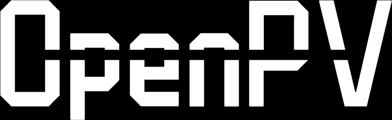
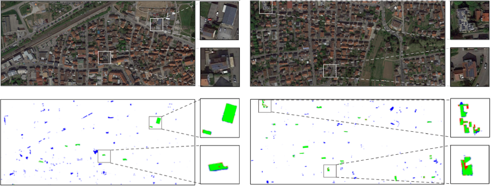
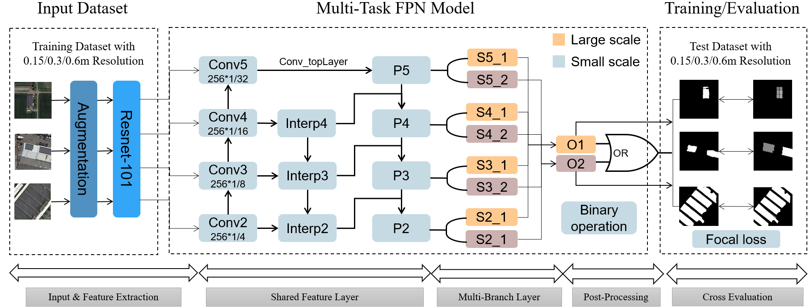
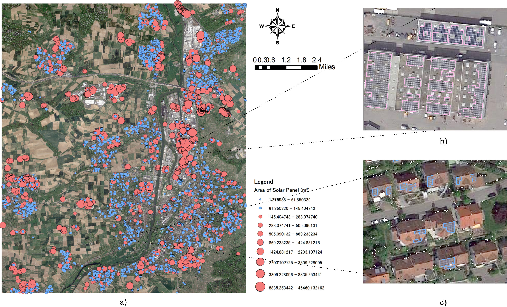
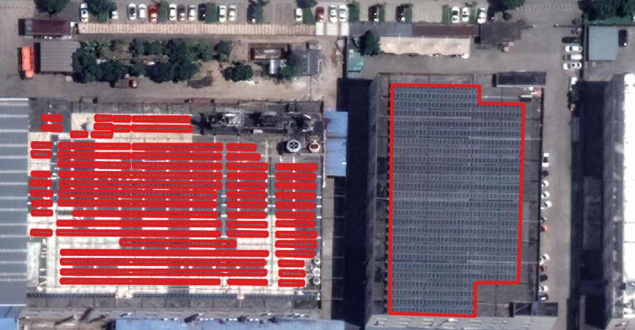

# Open Photovoltaics Toolkit(OpenPV)



## Introduction

OpenPV is an open source toolbox for solar photovoltaics semantic segmentation.



Major features

- **Unified Benchmark**

  We provide a unified benchmark toolbox for various semantic segmentation methods.

- **Modular Design**

  We decompose the semantic segmentation framework into different components and one can easily construct a customized semantic segmentation framework by combining different modules.

- **Support of multiple methods out of box**

  The toolbox directly supports popular and contemporary semantic segmentation frameworks, *e.g.* GeneNet, PSPNet, DeepLabV3, PSANet, DeepLabV3+, etc.

- **High efficiency**

  The training speed is faster than or comparable to other codebases.

## Usage

### Installation

Please refer to [get_started.md](https://github.com/open-mmlab/mmsegmentation/blob/master/docs/en/get_started.md#installation) for installation and dataset preparation.

### Customizing dataset

Take Heilbronn PV dataset for instance.

#### Convert datasets

```python
tools/convert_datasets/heilbronn_pv.py
```

Prepare data source in data_src 

```
heilbronn_pv
├── image
│   ├── id_1.tif
│   ├── id_2.tif
│   ├── id_3.tif
│   └── id_4.tif
└── label
    ├── id_1.tif
    ├── id_2.tif
    ├── id_3.tif
    └── id_4.tif
```

Run:

```bash
python tools/convert_datasets/heilbronn_pv.py path/to/data_src/heilbronn_pv -o path/to/data/heilbronn_pv
```

Output:

```
heilbronn_pv
├── img_dir
│   ├── train
│   ├── val
└── ann_dir
    ├── train
    ├── val
```

Note:

The annotations are images of shape (H, W), the value pixel should fall in range `[0, num_classes - 1]`. You may use `'P'` mode of [pillow](https://pillow.readthedocs.io/en/stable/handbook/concepts.html#palette) to create your annotation image with color. 

References:

1. [Prepare datasets](https://github.com/open-mmlab/mmsegmentation/blob/master/docs/en/dataset_prepare.md#prepare-datasets)
2. [Customize Datasets](https://github.com/open-mmlab/mmsegmentation/blob/master/docs/en/tutorials/customize_datasets.md)

#### Configs datasets

```bash
configs/_base_/datasets/heilbronn_pv.py
```

Modify:

```python
dataset_type = 'HeilbronnPVDataset'
data_root = '/home/user/Work/mmsegmentation/data/heilbronn_pv'
# add other options
```

#### Registry datasets

```bash
mmseg/datasets/heilbronn_pv.py
```

Modify:

```python
@DATASETS.register_module()
class HeilbronnPVDataset(CustomDataset):
    """Heilbronn PV dataset.

    In segmentation map annotation for pv, 0 stands for background,
    which is included in 2 categories. ``reduce_zero_label`` is fixed to False.
    The ``img_suffix`` is fixed to '.png' and ``seg_map_suffix`` is fixed to
    '.png'.
    """
    CLASSES = ('others', 'pv')

    PALETTE = [[255, 255, 255], [0, 255, 0]]

    def __init__(self, **kwargs):
        super(HeilbronnPVDataset, self).__init__(
            img_suffix='.png',
            seg_map_suffix='.png',
            reduce_zero_label=False,
            **kwargs)
```

Add in init.py:

```bash
mmseg/datasets/__init__.py
```

Modify:

```python
from .heilbronn_pv import HeilbronnPVDataset
__all__ = [HeilbronnPVDataset]
```


### Training & Evaluation

Training and inference the UperNet with ResNet-18 backbone on Heilbronn PV dataset:

#### Configs training

Create:

based on upernet_r18_512x512_160k_heilbronn_pv.py

```bash
/home/user/Work/mmsegmentation/configs/upernet/upernet_r18_512x512_160k_heilbronn_pv.py
```

Modify:

```bash
_base_ = [
    '../_base_/models/upernet_r50.py',
    '../_base_/datasets/heilbronn-pv.py', '../_base_/default_runtime.py',
    '../_base_/schedules/schedule_20k.py'
]
model = dict(
    pretrained='open-mmlab://resnet18_v1c',
    backbone=dict(depth=18),
    decode_head=dict(in_channels=[64, 128, 256, 512], num_classes=2),
    auxiliary_head=dict(in_channels=256, num_classes=2))
```

Run:

```bash
python tools/train.py ../configs/upernet/upernet_r18_512x512_160k_heilbronn_pv.py --work-dir ../work_dirs/upernet_r18_512x512_160k_heilbronn_pv.py --seed 0
```


### Inference

Run:

```bash
python tools/test.py ../configs/upernet/upernet_r18_512x512_160k_heilbronn_pv.py ../work_dirs/upernet_r18_512x512_160k_heilbronn_pv/latest.pth --show-dir ../results/upernet_r18_512x512_160k_heilbronn_pv_results --eval mIoU --out results.pkl
```


## Benchmark and model zoo

Results and models are available in the model zoo.

### Supported backbones:

- [x] ResNet (CVPR'2016)
- [x] ResNeXt (CVPR'2017)
- [x] [HRNet (CVPR'2019)](configs/hrnet)
- [x] [ResNeSt (ArXiv'2020)](configs/resnest)
- [x] [MobileNetV2 (CVPR'2018)](configs/mobilenet_v2)
- [x] [MobileNetV3 (ICCV'2019)](configs/mobilenet_v3)
- [x] [Vision Transformer (ICLR'2021)](configs/vit)
- [x] [Swin Transformer (ICCV'2021)](configs/swin)
- [x] [Twins (NeurIPS'2021)](configs/twins)
- [x] [BEiT (ICLR'2022)](configs/beit)
- [x] [ConvNeXt (CVPR'2022)](configs/convnext)
- [x] [MAE (CVPR'2022)](configs/mae)

### Supported methods:

- [x] [FCN (CVPR'2015/TPAMI'2017)](configs/fcn)
- [x] [ERFNet (T-ITS'2017)](configs/erfnet)
- [x] [UNet (MICCAI'2016/Nat. Methods'2019)](configs/unet)
- [x] [PSPNet (CVPR'2017)](configs/pspnet)
- [x] [DeepLabV3 (ArXiv'2017)](configs/deeplabv3)
- [x] [BiSeNetV1 (ECCV'2018)](configs/bisenetv1)
- [x] [PSANet (ECCV'2018)](configs/psanet)
- [x] [DeepLabV3+ (CVPR'2018)](configs/deeplabv3plus)
- [x] [UPerNet (ECCV'2018)](configs/upernet)
- [x] [ICNet (ECCV'2018)](configs/icnet)
- [x] [NonLocal Net (CVPR'2018)](configs/nonlocal_net)
- [x] [EncNet (CVPR'2018)](configs/encnet)
- [x] [Semantic FPN (CVPR'2019)](configs/sem_fpn)
- [x] [DANet (CVPR'2019)](configs/danet)
- [x] [APCNet (CVPR'2019)](configs/apcnet)
- [x] [EMANet (ICCV'2019)](configs/emanet)
- [x] [CCNet (ICCV'2019)](configs/ccnet)
- [x] [DMNet (ICCV'2019)](configs/dmnet)
- [x] [ANN (ICCV'2019)](configs/ann)
- [x] [GCNet (ICCVW'2019/TPAMI'2020)](configs/gcnet)
- [x] [FastFCN (ArXiv'2019)](configs/fastfcn)
- [x] [Fast-SCNN (ArXiv'2019)](configs/fastscnn)
- [x] [ISANet (ArXiv'2019/IJCV'2021)](configs/isanet)
- [x] [OCRNet (ECCV'2020)](configs/ocrnet)
- [x] [DNLNet (ECCV'2020)](configs/dnlnet)
- [x] [PointRend (CVPR'2020)](configs/point_rend)
- [x] [CGNet (TIP'2020)](configs/cgnet)
- [x] [BiSeNetV2 (IJCV'2021)](configs/bisenetv2)
- [x] [STDC (CVPR'2021)](configs/stdc)
- [x] [SETR (CVPR'2021)](configs/setr)
- [x] [DPT (ArXiv'2021)](configs/dpt)
- [x] [Segmenter (ICCV'2021)](configs/segmenter)
- [x] [SegFormer (NeurIPS'2021)](configs/segformer)
- [x] [K-Net (NeurIPS'2021)](configs/knet)
- [x] [Segmenter (ICCV'2021)](configs/segmenter)
- [x] [SegFormer (NeurIPS'2021)](configs/segformer)
- [x] GenePV



### Supported datasets:

- [x] Heilbronn, Germany

* pv polygons: 5442
* building polygons: 38737



- [x] Jiaxing, China

* pv polygons: 5755



- [x] Lanzhou, China

* pv polygons: under development


## Project status

This project is currently under development. We will continuously update this project.

### To Do:

- [ ] Learning to solve hard data unbalanced problems
- [ ] Transfer learning based methods
- [ ] weak-supervised learning based methods

## Authors and acknowledgment

We will add this part later shortly.

Zhiling Guo; Haoran Zhang; Qi Chen; Dou Huang; Qing Yu; Peiran Li; Zhan Zhuang; etc.

## Citation

If this repo is useful for your research, please consider citation

```
@article{li2021understanding,
  title={Understanding rooftop PV panel semantic segmentation of satellite and aerial images for better using machine learning},
  author={Li, Peiran and Zhang, Haoran and Guo, Zhiling and Lyu, Suxing and Chen, Jinyu and Li, Wenjing and Song, Xuan and Shibasaki, Ryosuke and Yan, Jinyue},
  journal={Advances in applied energy},
  volume={4},
  pages={100057},
  year={2021},
  publisher={Elsevier}
}
```

## References

[mmsegmentation](https://github.com/open-mmlab/mmsegmentation)

## Statement

Currently, this project is for research purpose only. For any other questions please contact guozhilingcc at u-tokyo.ac.jp

## License

OpenPV is released under the MIT license. Please refer to [LICENSES](LICENSE) for the careful check.