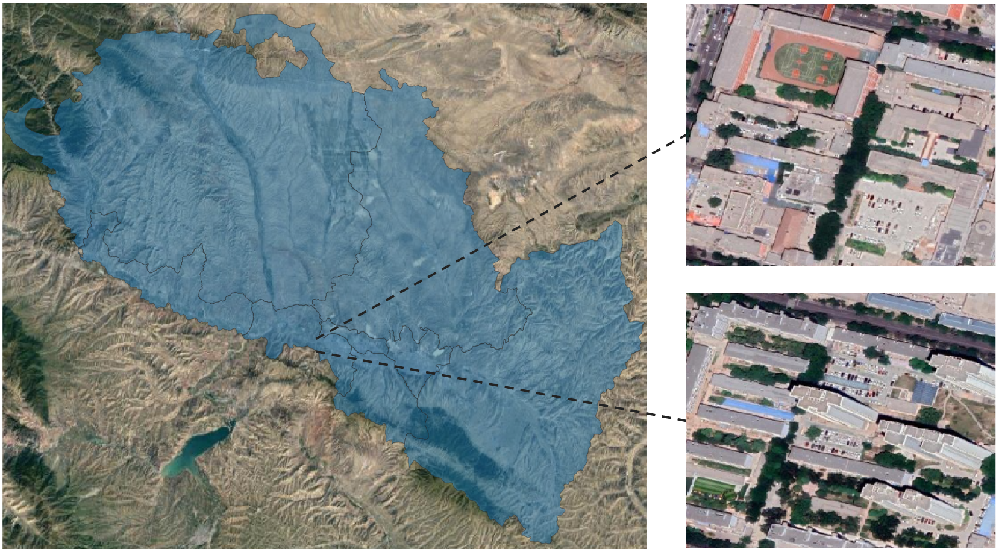

# Open Photovoltaics Toolkit(OpenPV)


## Introduction

OpenPV is an open source toolbox for solar photovoltaics semantic segmentation.


Major features

- **Unified Benchmark**

  We provide a unified benchmark toolbox for various semantic segmentation methods.

- **Modular Design**

  We decompose the semantic segmentation framework into different components and one can easily construct a customized semantic segmentation framework by combining different modules.

- **Support of multiple methods out of box**

  The toolbox directly supports popular and contemporary semantic segmentation frameworks, *e.g.* PSPNet, DeepLabV3, PSANet, DeepLabV3+, etc.

- **High efficiency**

  The training speed is faster than or comparable to other codebases.

## Usage

### Installation

Please refer to [get_started.md](https://github.com/open-mmlab/mmsegmentation/blob/master/docs/en/get_started.md#installation) for installation and dataset preparation

### Customizing dataset


### Training & Evaluation

Training and evaluation the UperNet with RSP-ResNet-50 backbone on Potsdam dataset:


### Inference


## Benchmark and model zoo

Results and models are available in the model zoo.

Supported backbones:

Supported methods:


Supported datasets:

- [x] Heilbronn, Germany

* pv polygons: 5442
* building polygons: 38737


- [x] Jiaxing, China

* pv polygons: 5755


- [x] Lanzhou, China

* pv polygons: Under development




## Project status

This project is currently under development. We will continuously update this project.

### To Do

- [ ] Learning to solve hard data unbalanced problems
- [ ] Transfer learning based methods
- [ ] weak-supervised learning based methods

## Authors and acknowledgment

We will add this part later shortly.

Zhiling Guo; Haoran Zhang; Qi Chen; Peiran Li; Zhan Zhuang; ...

## Citation

If this repo is useful for your research, please consider citation

```
@article{li2021understanding,
  title={Understanding rooftop PV panel semantic segmentation of satellite and aerial images for better using machine learning},
  author={Li, Peiran and Zhang, Haoran and Guo, Zhiling and Lyu, Suxing and Chen, Jinyu and Li, Wenjing and Song, Xuan and Shibasaki, Ryosuke and Yan, Jinyue},
  journal={Advances in applied energy},
  volume={4},
  pages={100057},
  year={2021},
  publisher={Elsevier}
}
```

## References

[mmsegmentation](https://github.com/open-mmlab/mmsegmentation)

## Statement

Currently, this project is for research purpose only. For any other questions please contact guozhilingcc at u-tokyo.ac.jp

## License

OpenMOB is released under the MIT license. Please refer to [LICENSES](LICENSE) for the careful check.